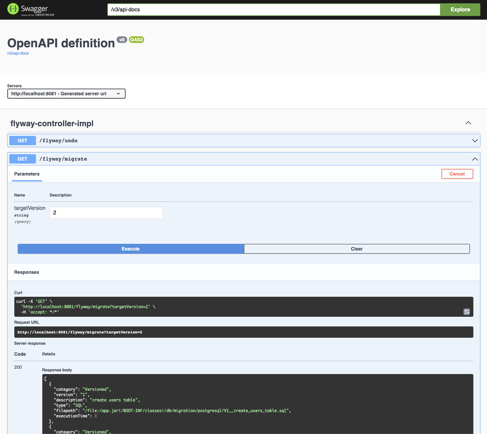

# Showcase of Flyway (Teams Edition) usage with postgresql

## Table of contents

- [General info](#general-info)
- [Technologies](#technologies)
- [Setup](#setup)
- [Usage](#usage)
- [Project Status](#project-status)
- [Screenshots](#screenshots)
- [About Owner](#about-owner)
- [Reference Documentation](#reference-documentation)
- [License](#license)

## General info

Showcase of Flyway (Teams Edition) with Migration and Undo (rollback) usage examples.

## Technologies

Project is created with technology:version

- Docker Engine: 20.10
- Docker-compose: 3.8
- Maven: 3.9.0
- Java: 17
- Spring Boot: 3.0.5
- Spring Actuator: 3.0.5
- Flyway Teams Edition:9.8.1
- Postgresql: 15
- OpenAPI: 3
- SwaggerUI
- Shell Scripting

## Setup

- Setup FLYWAY_LICENSE_KEY environment variable with your teams or enterprise flyway license key. If you don't have one, you can get a free trial on [redgate](https://www.red-gate.com/products/flyway/enterprise/trial/) webpage

1. Set your `FLYWAY_LICENSE_KEY` in [docker-compose.yml](docker-compose.yml) file
2. Set application properties (`server.port` and `spring.flyway.license-key`):
   - Add properties on [application.yml file](src/main/resources/application.yml).
   - And/Or add them as environment variables in runtime configuration.
3. Set `FLYWAY_LICENSE_KEY` environment variable:
```bash
export FLYWAY_LICENSE_KEY="XXXXXXXXXXXXXXXXXXXXXXXXXXXX"
```

Run postgresql server using docker compose:
```bash
docker compose up -d db adminer
```

If you want to run full showcase example with docker containers please, run:

```bash
docker compose up -d
```

This will compile and run showcase project that can be accessed from API endpoints.

## Usage

Flyway database configuration is set for postgresql by default using maven profiles functionality.

You can also add additional maven profiles with other database providers (h2, mysql, oracle) or new database migration scripts.

Database scripts should be added under db.migration.[database].

If you want to add rollback functionality it's necessary to add an "undo" script for each versioned (migration) script.

### Initialization script

Run example script using to initialize flyway migration and undo example:

```bash
./runFlywayExample.sh
```

### Run with maven

Run flyway maven plugin to migrate, undo, set baseline, get info...

Use [flyway maven plugin documentation](https://documentation.red-gate.com/fd/maven-goal-184127408.html) for more information.

#### Requirements

Running selected database (postgresql by default): see Setup

#### How to

```bash
mvn flyway:migrate -Dflyway.licenseKey=$FLYWAY_LICENSE_KEY
```

### Run with spring-boot

#### Requirements

Running selected database and spring-boot application.

#### How to

There are a rest API that executes flyway functions.

API documentation is available at http://localhost:8081/swagger-ui

## Project Status

<span style="color:green">**Stable Version**</span>

## Screenshots


<br>



## About Owner

Created by:

- [@javierddn](https://www.linkedin.com/in/javierdediegonavarro)
    - Github: https://github.com/javierddn
    - LinkedIn: https://www.linkedin.com/in/javierdediegonavarro
    - DockerHub: https://hub.docker.com/u/javierddn
    - Bitbucket: https://bitbucket.org/javierddn
    - Gitlab: https://gitlab.com/javierddn
    - TravisCI: https://app.travis-ci.com/github/javierddn
    - CircleCI: https://app.circleci.com/pipelines/github/javierddn

- [@eagerminds](https://www.linkedin.com/company/eager-minds)
    - Github: https://github.com/eager-minds
    - LinkedIn: https://www.linkedin.com/company/eager-minds
    - DockerHub: https://hub.docker.com/u/eagerminds
    - Bitbucket: https://bitbucket.org/eagerminds
    - TravisCI: https://app.travis-ci.com/github/eagerminds-javier
    - CircleCI: https://app.circleci.com/pipelines/github/eagerminds-javier

📩 Feel free to contact me! 📩

## Reference Documentation

For further reference, please consider the following sections:

* [Official Apache Maven documentation](https://maven.apache.org/guides/index.html)
* [Spring Boot Maven Plugin Reference Guide](https://docs.spring.io/spring-boot/docs/3.0.5/maven-plugin/reference/html/)
    * [6. Create an OCI image](https://docs.spring.io/spring-boot/docs/3.0.5/maven-plugin/reference/html/#build-image)
    * [18.9.5. Flyway Migration](https://docs.spring.io/spring-boot/docs/3.0.5/reference/htmlsingle/#howto.data-initialization.migration-tool.flyway)
* [Flyway Configuration](https://documentation.red-gate.com/fd/configuration-184127448.html)
* [flyway maven plugin documentation](https://documentation.red-gate.com/fd/maven-goal-184127408.html)
* [Docker Documentation](https://docs.docker.com/reference/)

## [License](LICENSE)

### APACHE LICENSE, VERSION 2.0